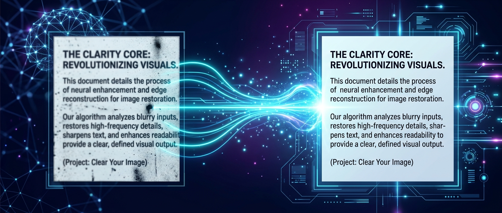
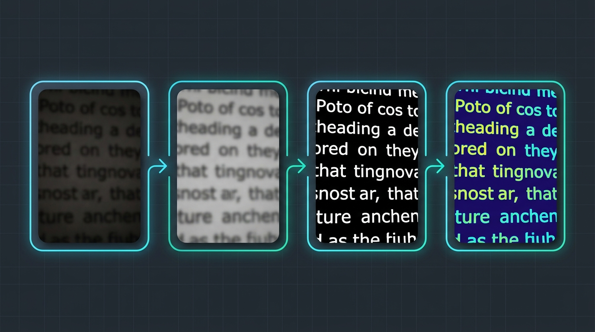
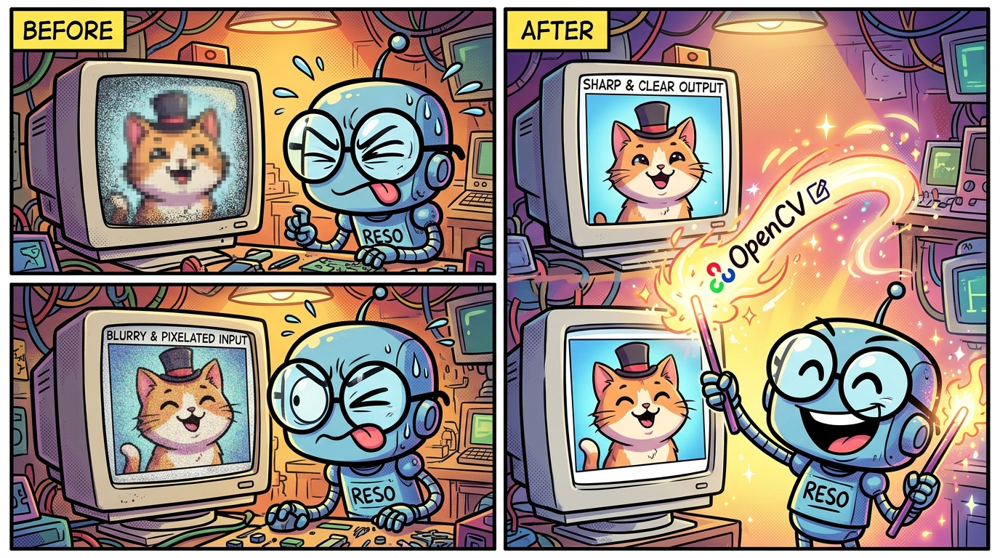

<div align="center">

<!-- Banner -->


<br/>

# 🔍 Clear Your Image

### *Because squinting at blurry photos is NOT a superpower* 🦸‍♂️

<br/>

[](https://www.python.org/)
[](https://opencv.org/)
[](LICENSE)
[](https://github.com/Ayushgupta0511/Clear_your_image/pulls)
[](https://github.com/Ayushgupta0511/Clear_your_image/stargazers)

<br/>

> **Took a photo of your notes in a dark lecture hall?** 📸  
> **Scanned a document but it looks like it was faxed from 1995?** 📠  
> **Your camera decided to have an existential crisis mid-shot?** 😵‍💫  
>  
> **Say no more. This tool's got you covered.** ✨

<br/>

---

</div>

## 🤖 What Does This Do?

This Python script takes your **blurry, dark, or noisy images** — especially photos of text/documents — and transforms them into **crystal-clear, readable masterpieces** using OpenCV's powerful image processing techniques.

**Three thresholding methods. One clean result. Zero headaches.** 🧠

<br/>

<div align="center">

### ⚡ The Magic Pipeline



<br/>

| Step | What Happens | Why It Matters |
|:---:|:---|:---|
| 📥 **Input** | Load your blurry image | *"Help me, OpenCV. You're my only hope."* |
| 🌫️ **Gaussian Blur** | Smooth out noise with a 21×21 kernel | Removes grain/artifacts before processing |
| ⚫⚪ **Binary Threshold** | Pixels → pure black or white (cutoff: 127) | Simple & effective for clean documents |
| 🎯 **Otsu's Threshold** | Auto-calculates the *perfect* threshold | Let the algorithm do the thinking |
| 🧩 **Adaptive Threshold** | Local neighborhood-based thresholding | Handles uneven lighting like a champ |

</div>

<br/>

---

## 😂 Meanwhile, Your Images Before vs After...

<div align="center">



<br/>

*Your images before and after this script. The robot is you. The wand is OpenCV.* 🪄

</div>

<br/>

---

## 🚀 Quick Start

### 1️⃣ Clone the Repo

```bash
git clone https://github.com/Ayushgupta0511/Clear_your_image.git
cd Clear_your_image
```

### 2️⃣ Install Dependencies

```bash
pip install -r requirements.txt
```

> **That's it. Just OpenCV. We keep it simple around here.** 😎

### 3️⃣ Run the Script

```bash
python clear_image.py your_blurry_image.jpg
```

### 4️⃣ Profit 💰

Your processed images will pop up in separate windows AND get saved to the `output/` folder.

<br/>

---

## 🖼️ Results Showcase

<div align="center">

### Before → After (Real Example)

<table>
<tr>
<td align="center"><b>📷 Original (Dark & Blurry)</b></td>
<td align="center"><b>🌫️ Gaussian Blur Applied</b></td>
</tr>
<tr>
<td></td>
<td></td>
</tr>
<tr>
<td align="center"><b>⚫⚪ Binary Threshold</b></td>
<td align="center"><b>🎯 Otsu's / Adaptive Threshold</b></td>
</tr>
<tr>
<td></td>
<td></td>
</tr>
</table>

<br/>

> 💡 **Pro Tip:** Try all three threshold outputs — different images work better with different methods!

</div>

<br/>

---

## 📖 The Code (It's Shorter Than You Think!)

```python
import cv2
import sys

# Read the image
img = cv2.imread("your_image.jpg")

# Convert to grayscale
gray = cv2.cvtColor(img, cv2.COLOR_BGR2GRAY)

# Apply Gaussian Blur to remove noise
gaus = cv2.GaussianBlur(gray, (21, 21), 0)

# 🎯 Method 1: Binary Threshold
_, threshold = cv2.threshold(gaus, 127, 255, cv2.THRESH_BINARY)

# 🎯 Method 2: Otsu's Binarization (auto threshold!)
_, threshold2 = cv2.threshold(gaus, 0, 255, cv2.THRESH_BINARY + cv2.THRESH_OTSU)

# 🎯 Method 3: Adaptive Threshold (handles uneven lighting)
threshold3 = cv2.adaptiveThreshold(
    gaus, 255,
    cv2.ADAPTIVE_THRESH_GAUSSIAN_C,
    cv2.THRESH_BINARY, 11, 2
)

# Show results
cv2.imshow("Original", img)
cv2.imshow("Threshold - Binary", threshold)
cv2.imshow("Threshold - Otsu", threshold2)
cv2.imshow("Threshold - Adaptive", threshold3)
cv2.waitKey(0)
cv2.destroyAllWindows()
```

> **Yep, that's it. Copy it. Use it. Love it.** ❤️

<br/>

---

## 🧠 How It Works (ELI5 Edition)

```
Your blurry image is like a dirty window 🪟
                    │
                    ▼
     ┌──────────────────────────┐
     │   1. GAUSSIAN BLUR       │  ← Cleans the window (removes noise)
     │   Like wiping with a     │
     │   soft cloth 🧽          │
     └──────────┬───────────────┘
                │
                ▼
     ┌──────────────────────────┐
     │   2. THRESHOLDING        │  ← Makes everything either
     │   "You're either BLACK   │     BLACK or WHITE
     │    or WHITE. Pick one."  │     No more gray zones! 🏁
     └──────────┬───────────────┘
                │
                ▼
     ┌──────────────────────────┐
     │   3. CRYSTAL CLEAR! ✨    │  ← Text is now readable
     │   Your image is now      │     Documents are clean
     │   ready to read 📖      │     Your eyes can relax 😌
     └──────────────────────────┘
```

<br/>

---

## 🎛️ Want to Tweak It?

| Parameter | What It Does | Try This |
|:---|:---|:---|
| `GaussianBlur(gray, (21, 21), 0)` | Kernel size for blur | `(5,5)` for less blur, `(51,51)` for more |
| `threshold(gaus, 127, 255, ...)` | Binary cutoff value | Lower = more white, Higher = more black |
| `adaptiveThreshold(..., 11, 2)` | Block size & constant | Adjust for different document types |

<br/>

---

## 📁 Project Structure

```
Clear_your_image/
├── 📄 clear_image.py       # Main script — the magic happens here
├── 📄 requirements.txt     # Dependencies (just OpenCV!)
├── 📄 README.md            # You are here 👋
├── 📂 assets/              # Images for README
│   ├── 🖼️ banner.jpg
│   ├── 🖼️ meme.jpg
│   └── 🖼️ pipeline.jpg
└── 📂 output/              # Processed images land here (auto-created)
```

<br/>

---

## 🤝 Contributing

Got ideas to make this even cooler? **PRs are welcome!**

```bash
# Fork the repo
# Create your feature branch
git checkout -b feature/amazing-feature

# Commit your changes
git commit -m "Add some amazing feature"

# Push to the branch
git push origin feature/amazing-feature

# Open a Pull Request 🎉
```

Some ideas:
- 🌈 Add color enhancement modes
- 📐 Auto-crop detection
- 🔄 Batch processing for multiple images
- 🖥️ Simple GUI with tkinter
- 📱 Web interface with Flask

<br/>

---

## 🌟 Star This Repo!

If this tool saved your blurry photos (or your grades 📚), consider giving it a ⭐!

It takes 1 second and makes my day! 🙏

<br/>

---

<div align="center">

### Made with ❤️ and OpenCV by [Ayush Gupta](https://github.com/Ayushgupta0511)

*"In a world full of blurry images, be the threshold that brings clarity."* ✨

<br/>


</div>
